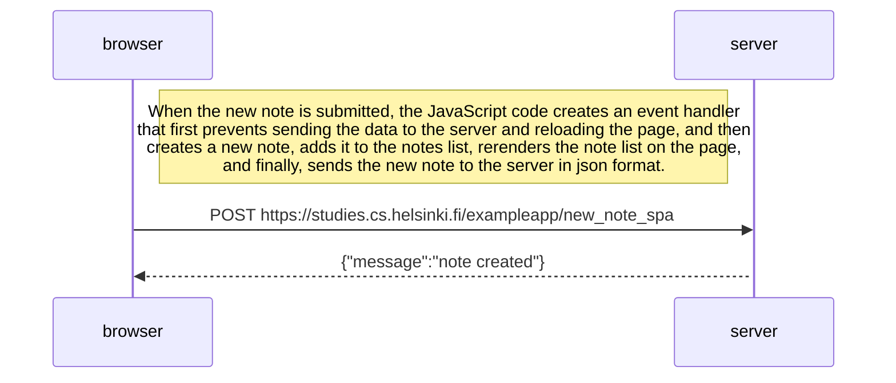

# Adding a new note in single page app: sequence diagram

```mermaid
sequenceDiagram
    participant browser
    participant server
    
    Note right of browser: When the new note is submitted, the JavaScript code creates an event handler<br>that first prevents sending the data to the server and reloading the page, and then<br>creates a new note, adds it to the notes list, rerenders the note list on the page,<br>and finally, sends the new note to the server in json format.
    browser->>server: POST https://studies.cs.helsinki.fi/exampleapp/new_note_spa
    activate server
    server-->>browser: {"message":"note created"}
```
